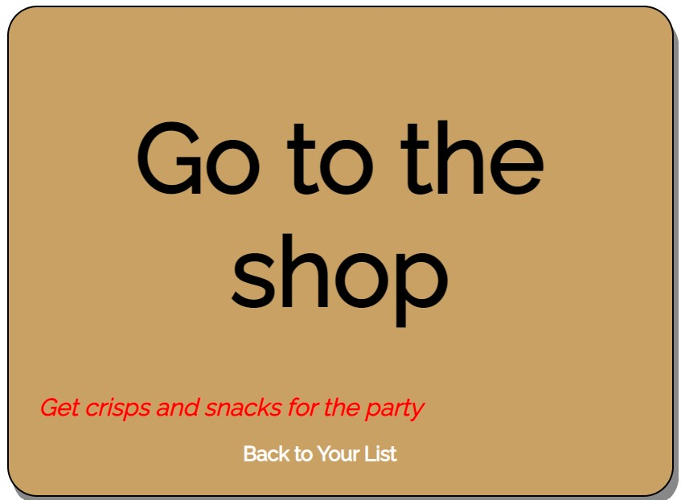
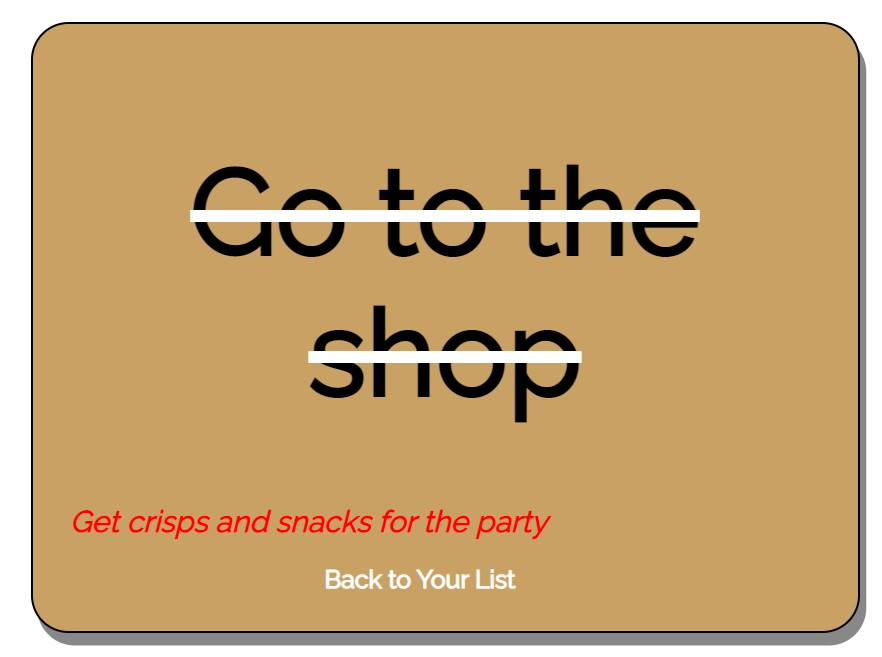

# ~~NO-EXCUSES~~

No Excuses app is a Django application, which runs in the Code Institute moke terminal on Heroku.
It is a responsive ToDo List app, that allows users to keep track of all kind of activities in an easy and nice way, as also performing other tasks such as update, delete and toggle.
To use the app, if not already in posses of an account, users  will have to register one which will allow to use it.
No excuses its an easy and intuitive app which allows the users once logged in to perform various actions.The application aims to be usefull to the user, helping tasks management from any kind of device.

[Here](https://no-excuses.herokuapp.com/){:target="_blank"} is a live view of the project.

## Table of Content

- [Features](#features)
  
  - [SignIn and SignUp](#signin-and-signup)
  
  - [No Excuses main page](#no-excuses-main-page)
  
  - [The Uppdate/Add task page](#the-updateadd-task-page)
  
  - [The Task Detail view](#the-task-detail-view)
  
  - [The Delete Task Page](#the-delete-task-page)
  
  - [The Logout Page](#the-logout-page)
  
- [Messages](#messages)
- [Responsive design](#responsive-design)
- [The Strategy plan](#the-strategy-plan)
- [Site Goals](#site-goals)
- [Epics](#epics)
- [User Stories](#user-stories)
- [Implemented User stories.](#implemented-user-stories)
- [Feature Features](#feature-features)
- [Wireframe Design and Styling Approach](#wireframe-design-and-styling-approach)
- [Database schema](#database-schema)
- [Testing](#testing)
  - [Manual testing](#manual-testing)
  - [Validator testing](#validator-testing)
  - [Lighthouse Testing](#lighthouse-testing)
  - [Notable Bugs and Issues](#notable-bugs-and-issues)
  - [Technologies used](#technologies-used)
  - [Packages Used](#packages-used)
  - [Miscellaneous](#miscellaneous)
  - [Documentation](#documentation)
  - [Deployment](#deployment)
  - [Credits](#credits)
  
## Features  

No Excuses app offers a range of features across its various pages, including Sign In, Sign Up functionality, a user-friendly main page for task management, intuitive Add/Update task pages for easy task modification, convenient task deletion, and a simple Logout option and functionality.
The landing page of the app is designed to provide users with a brief introduction and enticing message about the app's purpose and functionality.
The page greets users with an engaging introduction, emphasizing the importance of staying organized and on top of their tasks. It also offers convenient options to log in or register for a new account.

### SignIn and SignUp

- To provide access to the tasks, users are required to log in to the app by entering their registered username and password. If a user is not registered, they have the opportunity to create a new account by providing a username, password, and optional email address. Those authentication features are provided by "Django allauth" package, allowing the user to easily perform those actions. The authentications pages have been then customized to align with the overall style of the application.

### No Excuses main page

- Once logged in, the app welcomes the users and enables them to perform the following actions:

  - View Tasks: Users can easily access all the tasks, which are conveniently ordered by date, providing a clear overview of their task list.
  - Update and Delete: By clicking the "Update" and "Delete" links, users can navigate to dedicated pages to modify or permanently remove tasks, respectively.
  - Toggle Task Completion: Users can mark tasks as complete or incomplete by clicking the "Toggle" link. When a task is marked as complete, it is moved from the "To Do" section to the "Tasks Completed" section, and vice versa.
  - Add Task: Users add new tasy clicking the "Add Task" link, which redirects to a page where they can enter the necessary information for the task.
  - Search Task: A search bar allows users to quickly find a particular task by entering its name. The app retrieves matching tasks based on the search query. In case of empty or incorrect search inputs, the app provides appropriate notifications.
  - Logout: Users can securely log out from the app, ensuring the privacy and security of their tasks and account.

### The Update/Add task page

  When users click either the "Update" link next to a task or the "Add Task" link at the bottom of the page, they are redirected to a dedicated page where those actions can be performed. On this page, the users are  presented with the following options:

- Task Title: Users can enter a title for the task  updating or adding.
- Task Description: The task description field provides users with a full-featured text editor. This allows them to customize the appearance and format of their task description according to their preferences.
- Done Checkbox: Users have the option to mark the task as "Done" by checking the corresponding checkbox. When this checkbox is selected, the task is automatically updated in the task list to reflect its completion status.
- Submit Button: After entering the necessary information, users can click the Submit button to save and update the task or add a new task, depending on the action performed. By providing these input fields and options, the app enables users to easily update or add new tasks with personalized titles and detailed descriptions. The flexibility of the full-featured text editor ensures that users can customize the formatting and style of their task descriptions as desired.

### The Task Detail view

- When users click on a task from the main page, whether it is already completed or not, they are directed to the task detail page where they can view the task description. The representation of the task title on the task detail page differs based on its completion status:
- for tasks that are still to be done (not marked as completed), the task title is rendered normally, indicating that it is an active task.
- for completed tasks, the task title is displayed with a line-through effect, symbolizing that the task has been marked off as completed.
By visually distinguishing between completed and active tasks, the app provides users with a clear representation of their tasks increwasing the overall user experience .

### The Delete Task Page

- By cliking the "Delete" link beside the task, users are redirected to the Delete page, where will be asked if certain about removing the task chosen from the task list. Users will be able to confirm this action or go back to the main page.

### The Logout Page

- Finally the user will be able to safely leave the app by clicking the "Logout" link from the main page. Equally to the Sign In/Sign up features, the Logout is also provided by "Django allauth" package, but the additional "Go back to your list" link feature has been added to the customization of the page to improve the overall UX by giving the user flexibilty and options for who may have accessed the logout page by mistake or wish to continue using the app, giving the user full control of the application.
  
.

## Messages

The app incorporates informative messages for every action performed by the user. The messages have the purpose to keep the user informed reasing awareness over the changes and actions taken in the app. Those will be displayed for: successfull login and logout, added/updated task, deleted task and the mentioned above invalid or wrong search.

- Successful login message

- Successful logout message

- Added task message

- Updated task message

- Deleted task message

## Responsive design  

No-Excuses is a fully responsive application that adapts and displays optimally across different devices and screen sizes. It aims to provide a consistent and user-friendly experience for users accessing the app from various devices, such as desktops, laptops, tablets, and mobile phones.
For smaller devices, an additional customized horizontal scroll bar feature as been added to the application design, to allow the user to view the "Update", "Delete" and "Toggle" link beside the task, as stylistic consequence of the css attribute to the task container "overflow:auto", rather than allowing the contents to wrap onto multiple lines as the screen size decreases.
The horizontal scroll bar has been then customized, using the [Simplebar](https://grsmto.github.io/simplebar/) library, with the main objective of making the scroll bar visible and intuitive as also visually appealing and not restricted to the default layout, increasing the ux and harmously by inserting the feature in the application .

## The Strategy plan

 No Excuses app is intended to be a friendly and intuitive ToDo application that is usefull to the user in tasks management. With a simple layout but efficient and intuitive the user can effortlessy have access to the task list, customize its details, quickly retrieve it with a search funcionality, add, update, mark it as complete, permanently delete it and and have exclusively access to it thanks to a user authentication system.

## Site Goals

 The application objective is to develop a responsive and intuiitive ToDo list application that engages with the user with clear and frequent messages.

## Epics

 For the development of the project, 8 Epics with 8 User Stories were created.  Details of the Agile Design Thinking approach can be found in the project Kanban board [here](https://github.com/users/Villelligiulia/projects/4/views/1){:target="_blank"}

   1. View task list.
   2. Select a task.
   3. Manage a task.
   4. Mark a task complete.
   5. Search task.
   6. Account Registration.
   7. Important task.
   8. Set task due date and receive reminders.

## User Stories

For each Epic, one User Story has been developed for a total of 8 User Stories. Each story was assigned a label of Must-Have, Should-Have, Could-Have or Won't Have. Out of those Epics and respective User Stories, 6 were completed and implemented of which 5 with "must have" label, assigned to "Task Management App Mvp" that provides  core functionlity and essential task management features , and 1 with "should have" label providing  an additional element and increasing the overall user experience.
Individual user stories were categorised according to whether they had to be implemented to produce a Minimum Viable Product , with priority for development to be given to those that were part of the MVP specification.

## Implemented User stories

### Epic: View Task List#1

As User i can view the task list so that i can select and check the task i need to do.

#### Acceptance Criteria

- The user can access the task list page.
- The task list displays all tasks with their titles.
- The user can see an indication of completed tasks.

#### Implementation

- Create a route in Django for the task list page.
- Retrieve all tasks from the database.
- Clear access to the task list.
- Clear task titles in the task list template.
- Clear separation between completed and uncompleted tasks.

### Epic: Select a task#2

As User i can click on a particular task so that i can see the details of that task.

#### Acceptance Criteria

- The user can click on a task from the task list.
- Clicking on a task redirects the user to the task details page.

#### Implementation

- Create a  link for each task in the task list template.
- Create a designated task detail page.
- Create the path from the link to the task details page to redirect the user.
- Retrieve the specific task details from the database.
- Display the task details in the task details page.

### Epic: Manage tasks#3

As User i can read, add, update and delete tasks so that i can manage my tasks list.

#### Acceptance Criteria

- The user can create new tasks.
- The user can edit existing tasks.
- The user can delete tasks.

#### implementation

- Add a link to perform add action.
- Create designated add task page.
- Create a path to redirect the user to add task page.
- Create a form to register task info: title and description text field that comes with a full editor.
- Create a button to submit the action.
- Validate and save the new task to the database.
- Add a link to perform update action.
- Create a path to redirect the user to update task page.
- Pre-fill the form with already existing task detail for the user to update.
- Create a button to submit the action.
- Validate and update the task in the database.
- Create a link to perform delete action.
- Create a designated delete page.
- Create a path to redirect the user to delete page.
- Confirm the task deletion and remove it from the database.

### Epic: Mark a task as completed #4

As User i can mark a completed checkbox and strike a task off so that i know which tasks dont have to be done.

#### Acceptance criteria

- The user can mark a task as completed.
- Completed tasks are visually distinguished from active tasks.

#### Implementation

- In the task model add a checkbox to mark task as completed in the add/update page.
- Update the visual representation of the tasks reflecting the checkbox behaviour.
- Create a link to perform toggle action.
- Implement the functionality to toggle the completion status of tasks.
- Update the visual representation of the tasks reflecting checkbox behaviour.

### Epic: Account registration #7

As User i can register a new account so that i can be the only person that has access to the tasks list.

#### Acceptance criteria

- The user can register a new account.
- Account registration ensures unique access to the task list.

#### Implementation

- Clearly accessible link to login or register an account.
- Easy actions for the User in order to create an account.
- Restrict access to the task list exclusively to the logged in user.

### Epic: Search a task #5

As User i can search for a particular task so that i can be quicker in finding the task i'm interested into.

#### Acceptance criteria

 -The user can search for a task by its title.

- Search results display matching task.

#### Implementation

- Create an input text to insert the task title for the search.
- Create a search button to send request to retrieve the task searched.
- Retrieve correct task from tasklist.
- Return matching task to task searched.
- Handle possibile search senario such as invalid search or empty search.

## Feature Features

The remaining two users stories are yet to be implemented but are surely part of a future integration in the application.

- "Important task": marking a task as "important" helping the users out with the prioritization of their activities.
- "Set task due date and receive reminders" : to allow the user to fully rely on the app for the task management.

While the main focus of the project was to successfully achieve and deliver the implemententaion of the minimum viable product (MVP) and all its essential funcionality, and because of other reasons such as time limitations and Django inexperience, as also a later integrations of the above mentioned in the initial scope, the remaining two User Stories provide additional features that will enhance the funcionality and user experience of the app, pushing the application beyond the essential components and reaching completition as task management application.

## Wireframe Design and Styling Approach

Since from the planning stage of the app the idea was to create a simple and visually pleasing user interface. The wireframe of the project, developed using [Balsamiq](https://balsamiq.com/wireframes/){:target="_blank"}, reflects this intention ensuring the app is presented in a simple, clear and intuitive manner.
Although some minor stylistic changes were made in terms of the placement of certain elements during the development process, the final result stayed true to the original concept.
The app's simple style is consistently applied throughout its various pages, creating a cohesive and visually pleasing experience.

One clear idea that was conceived with the project was the design concepts of comunicating the main purpose of the app: the completion of the tasks. The title "No Excuses"has been carefully chosen to convey a sense of motivation and playfulness to the users. It's an inviting reminder that they have no excuses when it comes to getting their tasks done. The use of this title adds a touch of humor and positivity to the app, creating an engaging and encouraging atmosphere.
The title is styled with a line through as to symbolize the concept of a completed task and this stylistic approach is consistently taken over other pages of the application such as "Sign in", "Sign out", "Sign up" and and in displaying the tasks completed datails, clearly distinguished from the uncompleted ones.

## Database schema

The database schema was implemented using [Lucidchart](https://www.lucidchart.com/pages/?gspk=eXVsaWFzYWRvdmExOTMz&gsxid=ORkF5zrs1X9l&pscd=try.lucid.co&sid=3CehEubVwGiRLxsMJlM84OGyCDf2RrOo7WSLQzR9opc8me&utm_campaign=partnerstack&utm_medium=affiliate-partner&utm_source=yuliasadova1933){:target="_blank"}.

For the purpose of the project, a custom model called "Task" was created, based on the "Item" model of the "Hello Django" project, which has then been altered as per Project Portfolio requirements.
The User model is provided by Django's allauth package authentication system .
The relationship between the User model and the Task model is established through a foreign key relationship. In the Task model, the user field is a foreign key to the User model and by doing so each task is linked to a specific user.
The "Task" Model represents the structure of the task that the user creates and consists of the following fields:

- user: foreign key to the User model mentioned above.
- title : is a character field with a maximum length of 200 characters. It stores the title or name of the task.
- description: is a text field and is where the user stores additional informations about the task. The description field it's been implemented using the [Summernote](https://summernote.org/){:target="_blank"} library which provides a full text editor which allows the user to format and style the tasks, as also uplodiang media  and create tables using a familiar and user friendly interface.
It empowers users to express their thoughts, requirements, and additional information about each task in a visually appealing manner, further improving the over all user experience.
- done: this field is a boolean field set to False by default. It represents the completion status of the task where False represent incomplete and True complete. It allows the user to manipulate and control the behaviour of the task which will be reflected on the task list page.
- created: is a date time field with an attribute of "auto_add_now = True" which will automcatically records the date and time when the task was created.This field is used to estabilish the order of the tasks when those will be displayed on the main page and this is achieved by the Meta class that gives more information about the "Task" model. In this case the "ordering" attribute equal to "created" will allows the tasks to be displayed based on the date and time they were created ensuring the tasks are displayed in a consistent and predictable order.

## Testing

### Manual testing

For this project I have implemented manual testing strategy.
 Manual testing involves executing test cases and scenarios manually to identify defects, validate functionality, and ensure the overall quality of the application.

By conducting manual testing, I have been able to verify that the application meets the specified requirements, performs as expected, and delivers a satisfactory user experience.

The following tests have been performed to ensure the relaibility of the project:

- Task Creation:
  - Manually test the process of creating new tasks. Ensure that the required fields (such as title and description) are validated properly, and new tasks are successfully added to the task list.

- Task Editing:
  - Test the ability to edit existing tasks.
  - Verify that changes made to task details title and/or description, are properly updated and reflected in the task list.

- Task Deletion:
  - Check the deletion functionality to ensure that tasks can be removed from the task list without causing any errors or unexpected behavior.
  - Verify that the task deleted is permanetly removed from the task list.

- Done Checkbox:
  - Verify that the completed tasks reflects the behavior of the "Done" checkbox, if its marked the task is completed and placed under the "Tasked completed" else under the "To do" section.

- Task Details:
  - Explore the task details view and confirm that all the relevant information, such as title and description is displayed correctly.
  - Ensure that task completed title is marked with a line-through decoration and uncompleted one is displayed without decoration.

- Task Search:
  - Manually test the search functionality to ensure that users can find specific tasks by entering a specified title.
  - Verify that the search results display the expected matching tasks.
  - Verify that the search functions responds properly to unexpected behaviour :
    - the user cant search for an item not included in the task list and/or cant search without inserting any word in the search bar receiving in both circumstances a message from the app.

- User Login/Registration:
  - Test the user registration process.
  - Verify that new/existing users can successfully login/register.
  - Confirm that the logged in user has exclusive access to the task list.

- Links and Button:
  - Manual testing for all the links and button to ensure they perform the intended action and redirect the user as per link/button indication.

- User Interface:
  - Conduct visual testing to ensure that the user interface elements, layouts, and styling are consistent, user-friendly, and responsive across different devices and screen sizes.

- User Experience: Evaluate the overall user experience by simulating common user scenarios and workflows. Verify that the app behaves intuitively, provides appropriate feedback, and guides users through the tasks smoothly.

- Error Handling: Test error conditions, such as submitting invalid data or encountering network errors. Ensure that the app handles these situations displaying helpful error messages and allowing users to recover from errors.

- Testing: Verify that the app works correctly across different web browsers, such as Chrome, Firefox, Safari, and Edge.

### Validator testing

All code files were validated using suitable validators for the specific language.
All code validation passed with only errors or warnings for code generated by other parties.

- CI Python Linter passed the validation code for all py files with no errors, with exeption of Django built in code within the settings file which produced five line length errors.
- W3C HTML Validator passed the validation code for all html files with no errors with exeption of add-task.html due to the presence of Summernote editor.

- W3C css validator passed the css code with no errors

For the project JavaScript was used exclusively for two purposes:
- in conjunction with Bootstrap, to  implement the setTimeot function to schedule the
dismiss action for the messages displayed to the user, functionality the was taken from the "I think therefore i blog" project.
- to initilize the "Simplebar" library for the customisation of the scroll bar on smaller devices, using the DOMContentLoaded event listener.

## Lighthouse Testing

All the tests performed by Lighthouse toll scored 100 for Accessibility with exeption of the add/update page with a result of 95 for Accessibility due to Summernote editor.
Below the following results scored by Lighthouse toll:

## Notable Bugs and Issues

In the development of my project, I encountered a couple of bugs that required attention and resolution.

- I faced some challenges styling the Summernote editor, which by default was too large for the width of my page. My first approach has been adding a class to the classTask form in order to style the editor using that class in css, however this didnt work.
Consulting then [Summernote documentation](https://github.com/summernote/django-summernote){:target="_blank"} i menaged to fix the issue by adding SUMMERNOTE_CONFIG in my setting.py.

- Following the tuorial "I Think Therefore I Blog" i wasnt able to copy the allauth files into my templates folder. Running the command shown in the video "cp -r ../.pip-modules/lib/python3.8/site-packages/allauth/templates/* ./templates/allauth/" , i was getting "no such file or directory" Error. Looking on Slack i found other people which had already the same issue and i could get my solution there, thanks to the answer provided by a mentor in Code Institute.
I then followed those steps:
  - Indentify where i was in the root folder running the command "ls"
  - As my templates folder was there i didnt need the ".." in the code.
Running the command applying those modifications enabled me to copy the allauth files correctly into my templates folder.

- There was a bug related to task visibility in the task view when a user was logged in. The task view was displaying tasks belonging to other users as well, which compromised the intended user-specific functionality. To rectify this, i consulted the [Django documentation "Making queries" section](https://docs.djangoproject.com/en/3.2/topics/db/queries/){:target="_blank"}. I implemented a solution by filtering the tasks query to only retrieve tasks associated with the currently logged-in user. This restriction ensured that each user could only view their own tasks, enhancing data privacy and maintaining the intended user experience.

## Technologies used

- asgiref==3.7.2
- cloudinary==1.33.0
- dj-datal==0.5.0
- dj3-cloudinary-storage==0.0.6
- Django==3.2.19
- django-allauth==0.54.0
- django-summernote==0.8.20.0
- gunicorn==20.1.0
- oauthlib==3.2.2
- psycopg2==2.9.6
- PyJWT==2.7.0
- python3-openid==3.2.0
- pytz==2023.3
- requests-oauthlib==1.3.1
- sqlparse==0.4.4
- urllib3==1.26.5

- Django

  - Django was used as the main python framework in the development of this project.
  - Django AllAuth was utilised to provide enhanced user account management functionality.
  Django Templating was used to inject database data into html pages.

- Heroku

  - Was used as the cloud based platform to deploy the site on.
  - Heroku PostgreSQL was used as database for the project.

- JavaScript

Custom JavaScript was utilised to schedule the dismiss functionality of the messages the user receive after permorfim action thorougout the application and to initialize the "simplebar" library

- Bootstrap
  - Bootstrap  in conjunctin with JavaScript setTimeout function was implemented for its convenience in providing quick and effective styling options for the dismiss messages.

- HTML
  - Html has been used to build the structure of the displaying contents.
- CSS
  - Css it was used to customize the design of the project structure, providing the desired layout

## Packages Used

- Codeanywhere IDE was used to develop the project.
- GitHub was utilised for storing the files for this project.
- Balsamiq was used to implement the scheleton design of the project.
- Lucidchart was used to create the visual representation of project model.
- Summernote was used to incorporate a fully functional text editor in the description field.
- Simplebar was used to customize the horizontal scrollbar on the tasks view page.

## Miscellaneous

As visul representation of the "NoExcuses" logo i used the [Favicon generator](https://www.favicon.cc/){:target="_blank"} to enhance the visual appeal of the app, providing brading and recongnition.
The favicon incorporates the same color scheme as the app itself. It features a brown background color, which represents the app's aesthetic. On top of the background, there is a white letter "E" representing "Excuses," title of the app. Cutting across the icon is a bold black line, symbolizing the elimination of excuses and the determination to get things done. The design of the favicon captures the essence and purpose of the app, creating a visually appealing and meaningful representation.

## Documentation

For the development of the project a wide rane of documentation and a deep reference to the Django documentation was used.

- Django general documentation: (<https://docs.djangoproject.com/en/4.2/>){:target="_blank"}
  - Django allauth: (<https://django-allauth.readthedocs.io/en/latest/>){:target="_blank"}
  - Django class based view documentation: (<https://docs.djangoproject.com/en/4.2/topics/class-based-views/>){:target="_blank"}
  - Django template language: (<https://docs.djangoproject.com/en/4.2/ref/templates/language/>){:target="_blank"}
  - Django making queries: (<https://docs.djangoproject.com/en/4.2/topics/db/queries/>){:target="_blank"}
  - Django applications: (<https://docs.djangoproject.com/en/3.2/ref/applications/>){:target="_blank"}
  - Django URL handling: (<https://docs.djangoproject.com/en/3.2/topics/http/urls/>){:target="_blank"}
  - Django working with forms:(<https://docs.djangoproject.com/en/3.2/topics/forms/>){:target="_blank"}
  - Django render, redirect and get_object_or_404 shortcut functions: (<https://docs.djangoproject.com/en/3.2/topics/http/shortcuts/>){:target="_blank"}
- Summernote: (<https://github.com/summernote/django-summernote>){:target="_blank"}
- Simplebar:  (<https://github.com/Grsmto/simplebar>){:target="_blank"}

## Deployment

NoExcuses is deployed to Heroku, using an ElephantSQL Postgres database.
The application has been deployed following those steps:

- Sign up / Log in to Heroku
- From the main Heroku Dashboard page select 'New' and then 'Create New App'
- Give the project a name - I entered "no-excuses" and select a suitable region, then select create app. The name for the app must be unique.
- This will create the app within Heroku and bring you to the deploy tab. From the submenu at the top, navigate to the resources tab.
- Add the database to the app, in the add-ons section search for 'Heroku Postgres', select the package that appears and add 'Heroku Postgres' as the database
- Navigate to the setting tab, within the config vars section copy the DATABASE_URL to the clipboard for use in the Django configuration.
- Within the django app repository create a new file called env.py - within this file import the os library and set the environment variable for the DATABASE_URL pasting in the address copied from Heroku. The line should appear as os.environ["DATABASE_URL"]= "Paste the link in here"
- Add a secret key to the app using os.environ["SECRET_KEY"] = "your secret key goes here"
- Add the secret key just created to the Heroku Config Vars as SECRET_KEY for the KEY value and the secret key value you created as the VALUE
- In the settings.py file within the django app, import Path from pathlib, import os and import dj_database_url
insert the line if os.path.isfile("env.py"): import env
remove the insecure secret key that django has in the settings file by default and replace it with SECRET_KEY = os.environ.get('SECRET_KEY')
replace the databases section with DATABASES = { 'default': dj_database_url.parse(os.environ.get("DATABASE_URL"))} ensure the correct indentation for python is used.
- In the terminal migrate the models over to the new database connection
Navigate in a browser to cloudinary, log in, or create an account and log in.
- From the dashboard - copy the CLOUDINARY_URL to the clipboard
in the env.py file created earlier - add os.environ["CLOUDINARY_URL"] = "paste in the Url copied to the clipboard here"
In Heroku, add the CLOUDINARY_URL and value copied to the clipboard to the config vars
- Also add the KEY - DISABLE_COLLECTSTATIC with the Value - 1 to the config vars
this key value pair must be removed prior to final deployment
- Add the cloudinary libraries to the list of installed apps, the order they are inserted is important, 'cloudinary_storage' goes above 'django.contrib.staitcfiles' and 'cloudinary' goes below it.
- In the Settings.py file - add the STATIC files settings - the url, storage path, directory path, root path, media url and default file storage path.
- Link the file to the templates directory in Heroku TEMPLATES_DIR = os.path.join(BASE_DIR, 'templates')
Change the templates directory to TEMPLATES_DIR - 'DIRS': [TEMPLATES_DIR]
- Add Heroku to the ALLOWED_HOSTS list the format will be the app name given in Heroku when creating the app followed by .herokuapp.com
- In your code editor, create three new top level folders, media, static, templates
Create a new file on the top level directory - Procfile
- Within the Procfile add the code - web: guincorn PROJECT_NAME.wsgi
- In the terminal, add the changed files, commit and push to GitHub
- In Heroku, navigate to the deployment tab and deploy the branch manually - watch the build logs for any errors.
- Heroku will now build the app for you. Once it has completed the build process you will see a 'Your App Was Successfully Deployed' message and a link to the app to visit the live site.
  
## Credits

The "Hello Django" project has played a main role for the inspiration of the idea behind implementing a todo list application. The project provided a solid foundation for the overall structure and concept and basic funcionality. Additionaly , "I think therefore i Blog" provided the  integrated functionalities such as Allauth authentication, Summernote rich text editor, and Class-Based Views. These resources played an essential role in the development and implementation of key features within the project.
